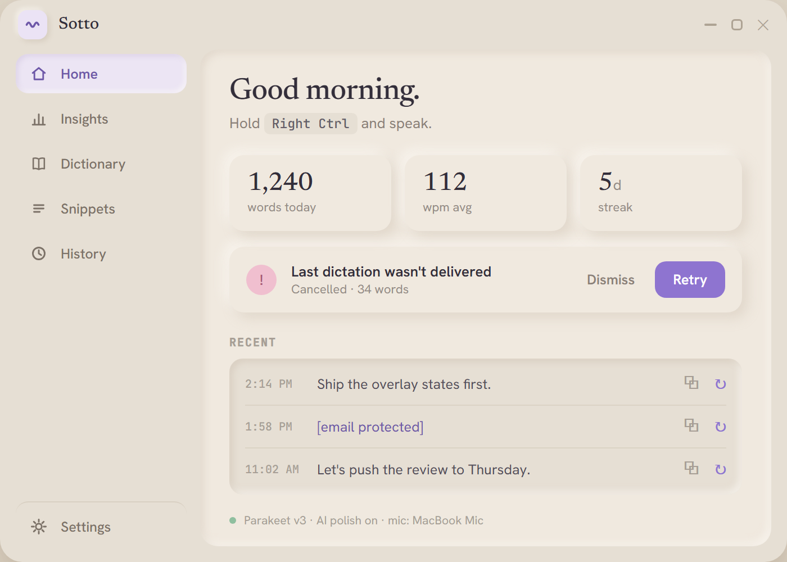
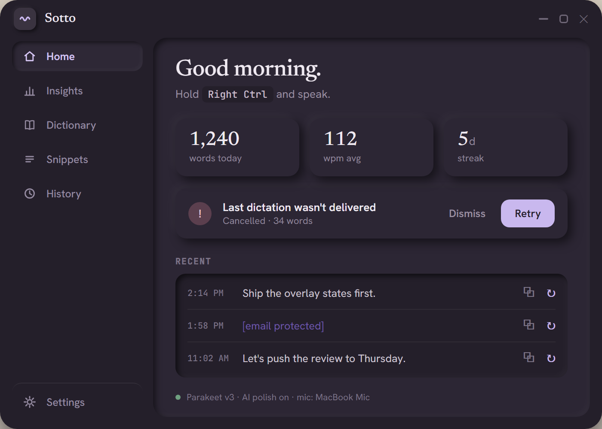
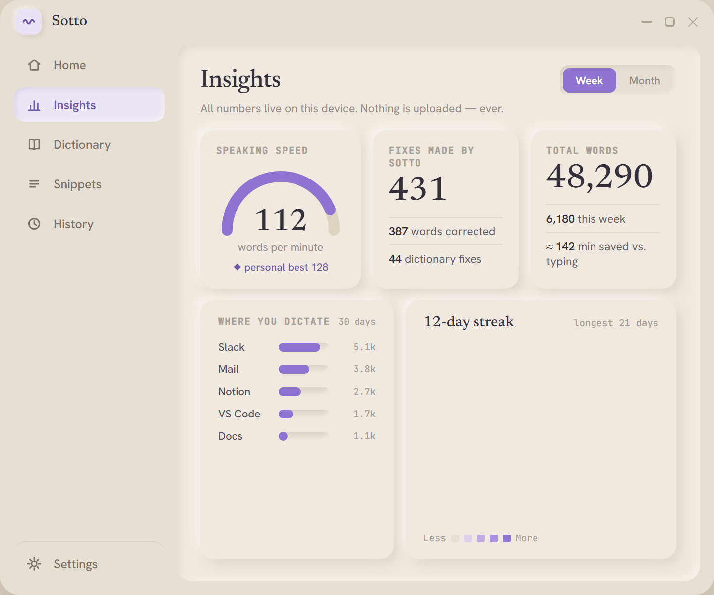
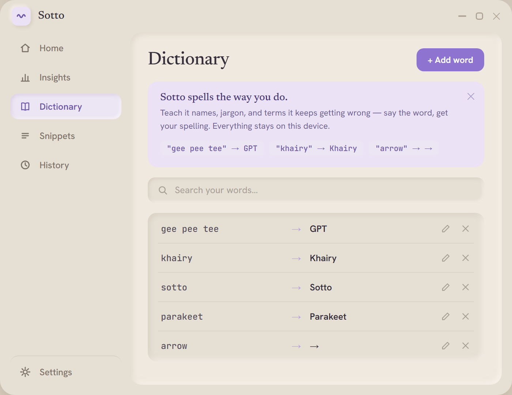

# Sotto — Local, Offline Voice-Dictation for Windows

<p align="center">
  
</p>

Sotto (*from "sotto voce" — in a quiet voice*) is a local, offline, hands-free voice-dictation utility for Windows. Built with **Rust, Tauri v2, and ONNX/llama.cpp**, it runs entirely offline on your device, respecting your privacy and system resources.

Hold (or toggle) a hotkey, speak, and Sotto will transcribe your voice using a local ASR model, clean it up with a local LLM, and paste/type it instantly into whatever application is currently focused.

The design philosophy of Sotto is **calm, quiet, precise, and unobtrusive** — a utility that lives at the edge of attention. State is communicated using **colors** so you can read the app's status peripherally without reading text.

<p align="center">
  
  
</p>
<p align="center">
  
  
</p>

---

## ✨ Features

- **Push-to-Talk & Toggle Modes:** Hold to speak and release to transcribe, or tap once to start and tap again to stop.
- **Offline ASR (Speech-to-Text):** Powered by NVIDIA's **Parakeet v3 int8** model running locally via ONNX Runtime.
- **AI Polish Tier:** Uses a local **Qwen2.5 1.5B Instruct** model via a background `llama.cpp` sidecar to clean up speech, correct grammar, fix stutters, and add punctuation.
- **Rule-Based Polish Tier:** Fast, instant, zero-cost rules cleanup for short phrases, bypassing the LLM round-trip.
- **Polish Word-Count Threshold:** Automatically routes shorter phrases through the rules tier and longer dictations through the AI tier.
- **Custom Dictionary & Snippets:** Define custom replacements (e.g., `"gee pee tee"` ➔ `GPT`, `"my email"` ➔ `dev@sotto.app`).
- **Cancel & Retry:** Press Escape (or click ✕ on the pill) to abort a dictation. The take is kept in memory, so ↻ on the pill — or **Retry last dictation** in the tray — re-runs it without speaking again.
- **Insights Dashboard:** Words dictated, time saved, WPM, per-app breakdown, and a weekday-aligned streak calendar. Stats are local-only and can be turned off.
- **Dictation History:** Recent dictations, with one click to re-copy or re-polish any row.
- **Calm UI Overlay:** A transparent, click-through pill that only accepts clicks when a button is actually under your cursor.
- **Themes & Zoom:** Light / Dark / follow-system, plus `Ctrl +` / `Ctrl -` / `Ctrl 0` to scale the whole window.
- **Launch at Login** and **Minimized Launch:** Start automatically, hidden to the system tray.
- **Clipboard Safety Net:** Every delivered dictation is also left on the clipboard, in case focus moved.

---

## 🎨 Visual Identity & State Signaling

Sotto uses the **Marshmallow** design language — a soft cream/lilac palette, Newsreader + Hanken Grotesk type, and a calm neumorphic surface treatment. The overlay is a small pill that reports state by **color and motion**, so you can read it peripherally without reading text:

<p align="center">
  
  
</p>
<p align="center"><sub>Live capture of the overlay pill — <b>listening → transcribing → polishing → done</b>, light and dark. The remaining states are described below.</sub></p>

| State | Color | What the pill shows |
| :--- | :--- | :--- |
| **Listening** | Lilac (`#8E74D0`) | Five bars dancing to your live mic level, plus a ✕ to cancel. |
| **Transcribing** | Amber (`#D4A06A`) | Bars give way to dots sweeping left to right. |
| **Polishing** | Gold (`#E8C78A`) | Drifting blobs with a shimmer and sparkles (AI tier only). |
| **Done** | Lilac (`#8E74D0`) | A checkmark draws itself, then the pill fades out. |
| **Cancelled** | Neutral | "Cancelled" + a ↻ to re-run the take. Auto-dismisses in 6s. |
| **Error** | Blush (`#F0BFCF`) | "Didn't catch that" + ↻. Muted, non-alarming. |
| **Model downloading** | Neutral | First-run only — the take is stashed, so ↻ works once the download lands. |

> [!NOTE]
> The design source is in the repo: **[`Sotto Marshmallow.dc.html`](./Sotto%20Marshmallow.dc.html)** (open it in any browser for the live spec — colors, shadows, type, motion), with a literal extraction at [`docs/marshmallow-spec-extracted.md`](./docs/marshmallow-spec-extracted.md).
> The earlier, superseded design lives at [`docs/images/design_handoff_sotto/Sotto.dc.html`](./docs/images/design_handoff_sotto/Sotto.dc.html) for reference only — it does **not** describe the current UI.

---

## 📦 Getting Started (For Users)

### 1. Install (~4 MB)
Grab the latest installer from the [**Releases page**](https://github.com/khairyKY/sotto/releases/latest) — pick `Sotto_x.y.z_x64-setup.exe` and run it.

> [!IMPORTANT]
> **Windows will warn you before it runs.** You'll see a blue **"Windows protected your PC"** screen. Click **More info → Run anyway**.
>
> This is expected, and it does **not** mean Sotto is malware. Windows shows that screen for any installer that isn't signed with a paid Authenticode certificate (~$100–200/year), which this project doesn't have. SmartScreen is reporting *"I don't recognise this publisher"*, not *"this is dangerous"*.
>
> Don't just take our word for it. You can check:
> - **Read the source.** All of it is in this repo, published for transparency. The installer is built from exactly this code.
> - **Scan it.** Upload the `.exe` to [VirusTotal](https://www.virustotal.com/) before running it.
> - **Watch the network.** Sotto contacts exactly two URLs, both on `github.com`: the [release feed](https://github.com/khairyKY/sotto/releases/latest/download/latest.json) (update check) and the [`assets-v1` release](https://github.com/khairyKY/sotto/releases/tag/assets-v1) (models, first run only). There is no telemetry or analytics of any kind — grep the source. It also talks to `127.0.0.1:8177`, which is the AI-polish model running on your own machine; that's loopback and never leaves your PC. Once the models are downloaded, pull your network cable and it still works.
> - **Check the signature.** Every release *is* cryptographically signed with [minisign](https://jedisct1.github.io/minisign/) for the auto-updater; that's what stops a tampered update from installing. It's just not the certificate flavour SmartScreen recognises.
>
> If you'd rather trust nothing, build it yourself — see [Development](#️-development--building-from-source).

### 2. First launch — one-time model download (~2.1 GB)
The installer is intentionally tiny because the models aren't in it. On first launch Sotto opens Settings and downloads them once into `%APPDATA%\sotto`, with a progress banner. After that, dictation works fully offline, and app updates never re-download any of it.

| Download | On disk | What it is |
| :--- | :--- | :--- |
| 1066 MB | 1066 MB | `qwen2.5-1.5b-instruct-q4_k_m.gguf` — the local LLM behind the **AI polish** tier |
| 446 MB | 639 MB | **Parakeet v3 int8** — the speech-recognition model |
| 647 MB | 1141 MB | `llama.cpp` runtime (the bulk is CUDA: `ggml-cuda` + `cuBLAS`) |
| 13 MB | 13 MB | `onnxruntime.dll` — runs the speech model |
| **~2.1 GB** | **~2.8 GB** | |

> [!TIP]
> Only the AI polish tier needs the LLM and its CUDA runtime (~1.7 GB of the total). The **Rules** tier is instant and local-only.

#### Putting the models on another drive

Short on space on your system drive? Set `assets_dir` in `%APPDATA%\sotto\config.toml` to put the big files anywhere you like, then restart Sotto:

```toml
assets_dir = 'D:\sotto'
```

Your settings and stats stay in `%APPDATA%\sotto` (a few KB) — only the ~2.8 GB moves. Settings then shows both locations, under **Data folder** and **Models folder**.

Already downloaded the models? Move `models\`, `runtime\`, and `onnxruntime.dll` into the new folder rather than re-downloading them.

### 3. Use it
Sotto launches minimized to the **system tray** (check the `^` overflow menu next to the clock). **Left-click** the tray icon to open the app; **right-click** for a menu with **Settings**, **Insights**, **History**, **Dictionary**, **Retry last dictation**, **Pause**, and **Quit**.

Open any app, hold **Right Ctrl** (the default — rebindable in Settings), speak, release. Sotto transcribes locally and pastes into the focused window. Press **Escape** to cancel; the take is kept so you can retry it.

### 4. Updates — one click, ~4 MB
Sotto checks GitHub on launch. When a newer version is out, the app window shows an **Install & restart** banner (dismissable with ✕). Click it — the small installer downloads, verifies its minisign signature, and relaunches. Your models and settings are untouched.

### 5. Uninstalling
Uninstall Sotto from **Settings → Apps** or via `Sotto_*_x64-setup.exe /uninstall`. The uninstaller removes the app, disables launch-at-login, and asks whether to also delete the ~2.8 GB of downloaded models and your settings (default: **keep**, so a reinstall is instant).

---

## 🩺 Troubleshooting

**Something's wrong — where's the log?**

`%APPDATA%\sotto\logs\sotto.log` (paste that into the Explorer address bar). Settings → **Data folder** → *Open folder* gets you there too.

- `sotto.log` — the current run. `sotto.log.1` — the previous one. Plain text; open it in Notepad.
- It records the app version, where it's reading models from, and what failed. **When reporting a bug, attach it** — it's the difference between a fix and a guessing game.
- It never contains your dictated text. Counts and timings only.
- Need more detail? Set `SOTTO_LOG=debug` and relaunch. `llama-server.log` in the same folder covers the AI polish sidecar.

| Symptom | Likely cause |
| :--- | :--- |
| Tray icon there, hotkey does nothing | Another app grabbed the same key — rebind it in Settings. |
| "Model downloading…" on the pill | First-run download hasn't finished. The take is stashed; press ↻ when it lands. |
| Transcription is slow | Expected today — inference is CPU-only, roughly real-time. GPU support is planned. |
| Text lands in the wrong window | Sotto pastes into whatever was focused when you *started* talking. It's also on your clipboard. |

---

## 🛠️ Development & Building from Source

Sotto is structured as a Tauri v2 application:
- **Rust Core:** Handles hotkey listening (`rdev`), audio recording (`cpal`), ASR (`transcribe-rs` over ONNX Runtime), local LLM integration (`llama.cpp` sidecar), and text injection (`windows`).
- **Frontend:** Transparent overlay pill and Settings windows built using HTML, CSS, and vanilla JS (`ui/`).

### Prerequisites
1. **Rust Toolchain:** Install Rust with MSVC support:
   ```powershell
   rustup override set stable-x86_64-pc-windows-msvc
   ```
2. **C++ Toolchain:** Requires MSVC Build Tools and the Windows SDK (installed by running `./scripts/setup-msvc.ps1` as Administrator).
3. **CMake + libclang.** The Whisper engine compiles `whisper.cpp` from source, and its Rust bindings are generated with `bindgen`. Without both of these the build fails on `Unable to find libclang`, which does not obviously mean "you're missing CMake too".
   ```powershell
   # CMake — any 3.x+; portable zip is fine, no installer needed
   $env:PATH = 'C:\path\to\cmake\bin;' + $env:PATH

   # libclang.dll. Full LLVM works, but it's ~2 GB for one DLL.
   # The `libclang` PyPI wheel ships the same DLL in ~80 MB:
   #   python -m pip install libclang
   $env:LIBCLANG_PATH = 'C:\path\to\python\Lib\site-packages\clang\native'
   ```
   Both are build-time only — neither is shipped or required by end users.
4. **Node.js:** For dev dependencies and bundling:
   ```powershell
   npm install
   ```

### Dev Commands
- **Run Sotto in Dev Mode:**
  ```powershell
  npx tauri dev
  ```
- **Build the Release Installers:**
  ```powershell
  npx tauri build
  ```
- **Preview the UI Frontend Standalone (browser, no build):**
  ```powershell
  node scripts/serve-ui.mjs
  ```
  *(Preview at `http://localhost:5173/index.html`, `/menu.html`, and `/preview.html`)*

- **Headless ASR on a WAV file:**
  ```powershell
  cargo run -- --transcribe path\to\audio.wav
  ```

- **Run the AI polish tier on a string (spawns the local LLM sidecar):**
  ```powershell
  cargo run -- --polish "<raw text>"
  ```

### Cutting a release

The updater workflow (bump version → sign → publish to GitHub Releases so every running app picks it up as a 4 MB update) is documented step-by-step in [`docs/updating.md`](./docs/updating.md).

---

## 🔒 Security & Privacy

- **100% Local:** All voice recordings are processed on your local CPU/GPU. No speech, transcripts, or keystrokes ever leave your device.
- **Single-Instance Protection:** Sotto uses a single-instance guard to ensure only one session can hook the keyboard at any time.
- **Keystroke Injection Safety:** Global key-event interception is temporarily suspended during text injection to prevent cyclic key-repeats or focus issues.

---

## ⚖️ License
All rights reserved. The source is public for transparency, not for reuse. See [LICENSE](./LICENSE).
